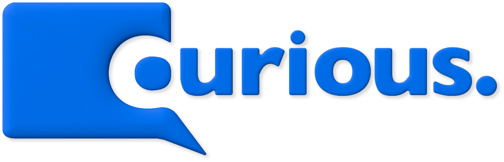
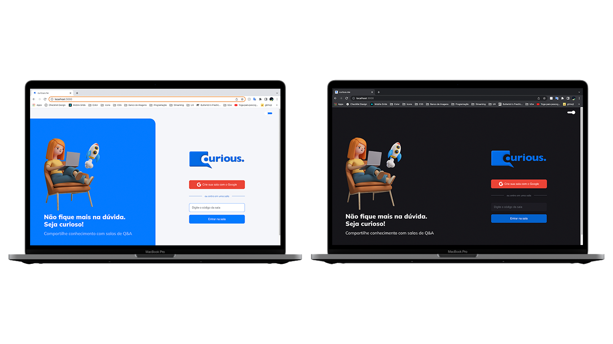

<h1 align="center">
  
</h1>

  <a href="#-tecnologias">Tecnologias</a>&nbsp;&nbsp;&nbsp;|&nbsp;&nbsp;&nbsp;
  <a href="#-projeto">Projeto</a>&nbsp;&nbsp;&nbsp;|&nbsp;&nbsp;&nbsp;
  <a href="#-diferenciais">Diferenciais</a>&nbsp;&nbsp;&nbsp;|&nbsp;&nbsp;&nbsp;
  <a href="#-layout">Layout</a>&nbsp;&nbsp;&nbsp;|&nbsp;&nbsp;&nbsp;
  <a href="#-como-executar">Como executar</a>&nbsp;&nbsp;&nbsp;|&nbsp;&nbsp;&nbsp;
  <a href="#-licença">Licença</a>

  

## 🌟 Tecnologias

Esse projeto foi desenvolvido com as seguintes tecnologias:

- [React](https://reactjs.org)
- [Firebase](https://firebase.google.com/)
- [TypeScript](https://www.typescriptlang.org/)
- [Styled Components](https://styled-components.com/)

## 💻 Projeto

**Curious.me** é uma plataforma de perguntas com objetivo de facilitar a interação entre palestrantes e audiência de forma organizada e democrática. Não fique com dúvidas. Seja curioso!

Este é um projeto baseado na aplicação desenvolvida durante a **[Next Level Week Together](https://nextlevelweek.com/)** de junho de 2021.

## 🥇 WIP: Diferenciais

- [x] Arquitetura do projeto
- [x] Regras do Firebase
- [x] react-modal
- [x] Temas: light e dark
- [x] Identidade visual
- [x] Responsividade
- [x] Favicon
- [x] Página: 404

 

- [x] WIP: Styeld Components
- [x] WIP: Melhorias de usabilidade

 

- [ ] Tratativa de permissões negadas
- [ ] Página: "Minhas salas"
- [ ] Componente: "Nenhuma pergunta por aqui"
- [ ] Componente: "Compartilhar no whatsapp"
- [ ] Permitir perguntas anônimas
- [ ] react-hot-toast
- [ ] Refatoração do listener de questões
- [ ] Testes E2E
- [ ] Deploy integrado

## 🔖 WIP: Layout

Você pode visualizar o layout do projeto através do link abaixo:

- [Layout Web](https://www.figma.com/file/vCiIL9viu2A2ecMSmjF4Rn/curious.me?node-id=0%3A1)

## 🚀 Como executar

- Clone o repositório
- Instale as dependências com `yarn`
- Inicie o servidor com `yarn dev`

Agora você pode acessar [`localhost:3000`](http://localhost:3000) do seu navegador.

## 📄 Licença

Esse projeto está sob a licença MIT. Veja o arquivo [LICENSE](LICENSE.md) para mais detalhes.

---

Made with ❤️ by [@priscilaandreani](https://github.com/priscilaandreani). Feel free to contribute!
